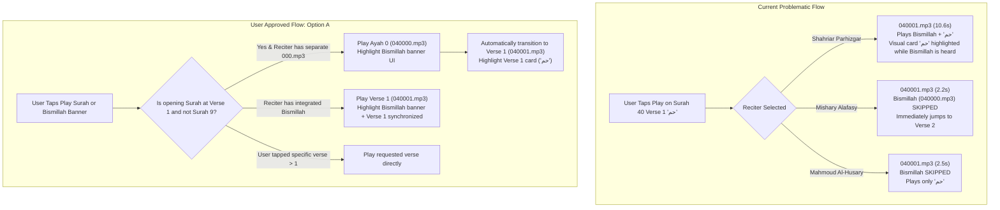

# Implementation Plan - Audio Recitation Fix for Surah Ghafir and Similar Surahs

## Problem Analysis & Executive Summary

When reciting verses in **Surah Ghafir (سورة غافر - Surah 40)** and similar Surahs (specifically the **Hawamim** family: Surahs 40 through 46, and other chapters beginning with short *Muqatta'at* letters), users observe that verse-by-verse audio recitation does not behave properly.

Through code and audio stream analysis across the app codebase, EveryAyah audio CDNs, and SQLite verse seed tables, we identified four interconnected root causes:

### 1. Bismillah Discrepancy & Reciter Audio Packaging Mismatches
- **Parhizgar (`Parhizgar_48kbps` - Default Reciter)**: In EveryAyah, Parhizgar **combines** the Basmalah into the first numbered verse file (`040001.mp3`). The audio is ~10.6 seconds long, with the first 8 seconds reciting *"Bismillahir Rahmanir Rahim"* and only the last 2 seconds reciting *"Ha-Meem"*.
  - In the UI ([verse_detail_view.dart](file:///e:/projects/quran_mobile_app/src/quran_mobile_app/lib/src/features/reader/verse_detail_view.dart#L950-L976)), Bismillah is displayed in an unnumbered, unclickable decorative banner at the top, separate from Verse 1.
  - When the user taps play on Verse 1 (`[40:1]` - `حم`), the Verse 1 card highlights as playing, but the reciter reads the Bismillah text from the banner above. If the user enables verse repeat or Hifz loop on Verse 1, Bismillah is re-recited on every iteration.
- **Alafasy (`Alafasy_128kbps`) & Abdul Basit (`Abdul_Basit_Mujawwad_128kbps`)**: These reciters isolate Bismillah into track `000` (e.g., `040000.mp3`, which is 9 seconds long) and record *only* `حم` into `040001.mp3` (~2 seconds).
  - However, the mobile app's audio system ([audio_repository.dart](file:///e:/projects/quran_mobile_app/src/quran_mobile_app/lib/src/features/audio/data/audio_repository.dart#L50-L60) and [audio_player_notifier.dart](file:///e:/projects/quran_mobile_app/src/quran_mobile_app/lib/src/features/audio/presentation/audio_player_notifier.dart#L305-L370)) only queries `1 <= verseNumber <= totalVerses`.
  - As a result, **Bismillah (`040000.mp3`) is never fetched or played**. When a user plays Surah Ghafir, it starts directly with `040001.mp3` ("Ha-Meem"), completely skipping Bismillah.
- **Al-Husary (`Husary_128kbps`)**: EveryAyah returns HTTP 404 for `040000.mp3`, and `040001.mp3` contains only `حم`. Bismillah is likewise missing.

### 2. The "Short Muqatta'at Verse" (Hawamim) Rapid Transition & Scroll Jitter
- Surah Ghafir (40) is the first of the seven **Hawamim (حوامیم)** Surahs (Surahs 40–46: Ghafir, Fussilat, Ash-Shura, Az-Zukhruf, Ad-Dukhan, Al-Jathiyah, Al-Ahqaf), where Verse 1 is simply the two-letter word **"حم"** (Ha-Meem).
- For reciters with standalone Verse 1 audio (Alafasy), Verse 1 lasts barely 2 seconds.
- In [verse_detail_view.dart](file:///e:/projects/quran_mobile_app/src/quran_mobile_app/lib/src/features/reader/verse_detail_view.dart#L77-L130), auto-scroll triggers a 350ms scroll animation followed by a 250ms `ensureVisible` adjustment (total ~600ms).
- When Verse 1 finishes in ~2 seconds, `onPlayerComplete` fires almost immediately and triggers Verse 2. The scroll controller is interrupted while still easing into Verse 1, causing a visible jump/jitter and giving the impression that Verse 1 was skipped or malfunctioned.

### 3. Offline Audio Downloader Omits Verse 0
- In [audio_download_notifier.dart](file:///e:/projects/quran_mobile_app/src/quran_mobile_app/lib/src/features/audio/presentation/audio_download_notifier.dart#L114-L136), `downloadSurah()` only iterates `for (int v = 1; v <= totalVerses; v++)`.
- Verse 0 (`040000.mp3`) is never downloaded, ensuring that even in offline mode, reciters with separate Bismillah files will never have opening Bismillah audio.

### 4. Lack of Unified Surah-Level Opening Audio Sequence
- When a user taps to "play a Surah from the beginning" (e.g. from the Surah header or bottom bar), the app directly plays Verse 1.
- In Islamic recitation etiquette, all Surahs except Surah At-Tawbah (9) begin with Bismillah. The player currently has no dedicated concept of an opening preamble (Ayah 0) that gracefully precedes Verse 1 when starting recitation of a Surah.



---

## Approved Design Strategy

**User Decision**: **Option A (Interactive Bismillah Banner)**
1. **Interactive Bismillah Header**: The top Bismillah banner in [verse_detail_view.dart](file:///e:/projects/quran_mobile_app/src/quran_mobile_app/lib/src/features/reader/verse_detail_view.dart) is upgraded from a static container to an interactive card equipped with a Play/Pause button and an active audio listening state (`isAudioActive`).
2. **Ayah 0 Support**:
   - For reciters with independent Bismillah tracks (`alafasy`, `abdulbasit`): Starting a Surah (or tapping the Bismillah play button) streams `000.mp3` with the Bismillah banner highlighted. Upon completion, it automatically proceeds to Verse 1 (`001.mp3`).
   - For reciters with integrated Bismillah (`parhizgar`): Starting the Surah or tapping Bismillah plays `001.mp3` while visually coordinating the Bismillah banner and Verse 1 card.
   - For Surah 9 (At-Tawbah): Bismillah is skipped entirely.
   - For Surah 1 (Al-Fatihah): Bismillah is Verse 1 itself.
3. **Smooth Scroll Easing for Short Verses**: Introduce a viewport visibility threshold check in `_scrollToVerse` so that short verses like "حم" do not trigger conflicting animation interruptions when advancing to Verse 2.
4. **Offline Downloader Enhancement**: Include track 0 in offline downloads when supported by the active reciter.

---

## Proposed Changes

### Component: Audio Data & Repository Layer (`src/quran_mobile_app/lib/src/features/audio/data`)

#### [MODIFY] [audio_repository.dart](file:///e:/projects/quran_mobile_app/src/quran_mobile_app/lib/src/features/audio/data/audio_repository.dart)
- Add property `final bool hasSeparateBismillahAudio;` to `Reciter` model.
  - `alafasy: true`
  - `abdulbasit: true`
  - `parhizgar: false`
  - `husary: false`
- Support `verseId == 0` in `getAyahAudioUrl()`:
  ```dart
  String _buildFallbackUrl(String reciterId, int surahId, int verseId) {
    final s = surahId.toString().padLeft(3, '0');
    final v = verseId.toString().padLeft(3, '0');
    ...
    return 'https://everyayah.com/data/$folderName/$s$v.mp3';
  }
  ```
  When `verseId == 0`, produces e.g. `.../Alafasy_128kbps/040000.mp3`.

#### [MODIFY] [audio_storage_service.dart](file:///e:/projects/quran_mobile_app/src/quran_mobile_app/lib/src/features/audio/data/audio_storage_service.dart)
- Support storing and checking verse `0` for offline caching (`040000.mp3`).

---

### Component: Audio Player State & Notifier Layer (`src/quran_mobile_app/lib/src/features/audio/presentation`)

#### [MODIFY] [audio_player_notifier.dart](file:///e:/projects/quran_mobile_app/src/quran_mobile_app/lib/src/features/audio/presentation/audio_player_notifier.dart)
- Allow `currentVerseNumber == 0` in `AudioPlayerState` to indicate that opening Bismillah is currently playing.
- In `playVerse(int surahId, int verseNumber, int totalVerses, {bool isSurahStart = false})`:
  - If `isSurahStart == true` and `verseNumber == 1` and `surahId != 1` and `surahId != 9`:
    - If `state.currentReciter?.hasSeparateBismillahAudio == true`:
      - Play `verseNumber: 0` first.
  - Otherwise, play requested verse directly.
- In `_onAudioCompleted()`:
  - If `verseNum == 0`: immediately advance to `playVerse(surahId, 1, totalVerses)`.
- Method `playBismillah(int surahId, int totalVerses)` to allow tapping the Bismillah banner directly.

#### [MODIFY] [audio_download_notifier.dart](file:///e:/projects/quran_mobile_app/src/quran_mobile_app/lib/src/features/audio/presentation/audio_download_notifier.dart)
- In `downloadSurah()`:
  - If reciter has separate Bismillah and `surahId != 1 && surahId != 9`, download `v = 0` (`040000.mp3`) before verses `1..totalVerses`.

---

### Component: Reader UI (`src/quran_mobile_app/lib/src/features/reader`)

#### [MODIFY] [verse_detail_view.dart](file:///e:/projects/quran_mobile_app/src/quran_mobile_app/lib/src/features/reader/verse_detail_view.dart)
- Enhance the Bismillah header banner widget:
  - Add Play/Pause icon button.
  - Watch `audioState`: if `audioState.currentSurahId == widget.surah.number && audioState.currentVerseNumber == 0`, apply active theme highlight border and background tint.
  - Tapping play on Bismillah banner triggers `audioNotifier.playBismillah(widget.surah.number, verses.length)`.
- In `_scrollToVerse`:
  - When `verseNumber == 0`, animate to top (`offset: 0`).
  - Add visibility check before animating: if the target verse is already in view, skip redundant animation to prevent jumpiness on short verses like "حم".

---

## Verification Plan

### Automated Tests
1. **Audio Repository Tests**:
   - Unit test verifying `getAyahAudioUrl('alafasy', 40, 0)` generates valid `040000.mp3` URL.
   - Unit test verifying `getAyahAudioUrl('parhizgar', 40, 1)` generates valid `040001.mp3` URL.
2. **Audio Notifier State Tests**:
   - Verify starting Surah 40 with Alafasy plays verse 0 (Bismillah) then verse 1 (`حم`), then verse 2.
   - Verify starting Surah 40 with Parhizgar plays verse 1 directly.
   - Verify Surah 9 (At-Tawbah) never plays verse 0.
   - Verify Surah 1 (Al-Fatihah) plays verse 1 directly.
3. **Flutter Analyze & Tests**:
   - Run `flutter analyze` in `src/quran_mobile_app`.
   - Run `flutter test` in `src/quran_mobile_app`.

### Manual Verification
1. Open Surah 40 (غافر) with reciter **Mishary Rashid Alafasy**:
   - Tap "Play" on Bismillah banner or Verse 1.
   - Verify Bismillah audio is recited first, then Verse 1 ("حم"), then Verse 2.
   - Verify the Bismillah banner highlights while reciting Bismillah, then smoothly transitions to Verse 1 card.
2. Switch reciter to **Shahriar Parhizgar**:
   - Tap "Play" on Verse 1 or Bismillah banner.
   - Verify smooth playback and coordinated highlight without stutter.
3. Test Surahs 41–46 (the other Hawamim chapters starting with `حم`):
   - Confirm consistent recitation behavior across all Hawamim Surahs.
