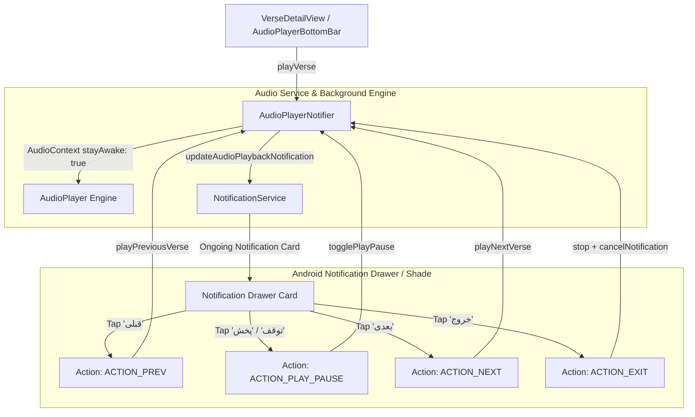

# Background Audio Recitation & Notification Shade Controller Implementation Plan

## 1. Goal Description
Ensure the Quran Mobile App continues reciting audio uninterrupted in the background when the app is minimized or the screen is locked, while displaying a persistent, interactive media controller notification in the Android notification drawer / shade (as shown in the user's reference image). Provide an explicit **Exit** button ("خروج") directly inside the notification window to immediately stop playback and dismiss the notification when no longer needed.

---

## 2. User Review Required

> [!IMPORTANT]
> **Key Design Decisions**:
> 1. **Silent Verse Advancement**: The notification channel (`quran_audio_playback_channel`) is configured with `Importance.low` and `playSound: false`. This ensures that when the app automatically advances from Verse 1 to Verse 2, 3, etc., the phone will not chime or vibrate every few seconds, but the notification card remains updated with the new Ayah number and Surah title.
> 2. **Notification Drawer Actions**: Four action buttons will be displayed in the Android notification drawer card:
>    - **قبلی (Prev)**: Skips to previous verse.
>    - **توقف / پخش (Pause / Play)**: Toggles playback state in real-time.
>    - **بعدی (Next)**: Advances to next verse.
>    - **خروج (Exit)**: Instantly terminates audio playback, releases wake locks, and clears the notification card from the shade.
> 3. **Android 13+ Notification Permission Prompt**: On app startup in `main.dart`, we trigger `NotificationService.instance.requestPermissions()` so Android 13+ devices grant permission upfront without requiring the user to manually visit Android System Settings.

---

## 3. Architecture & Data Flow



---

## 4. Proposed Changes

### Component 1: `NotificationService`
#### [MODIFY] [`src/core/notifications/notification_service.dart`](file:///e:/projects/quran_mobile_app/src/quran_mobile_app/lib/src/core/notifications/notification_service.dart)

- Add audio playback channel identifier and notification ID:
  ```dart
  static const String channelAudioPlayback = 'quran_audio_playback_channel';
  static const int idAudioPlayback = 3001;
  ```
- Register the playback channel during initialization with `Importance.low`, `playSound: false`, and `enableVibration: false`.
- Register action callbacks:
  ```dart
  void registerAudioActionCallbacks({
    required VoidCallback onPlayPause,
    required VoidCallback onNextVerse,
    required VoidCallback onPreviousVerse,
    required VoidCallback onExit,
  });
  ```
- Implement `updateAudioPlaybackNotification`:
  ```dart
  Future<void> updateAudioPlaybackNotification({
    required int surahId,
    required String surahName,
    required int verseNumber,
    required int totalVerses,
    required String reciterName,
    required bool isPlaying,
  });
  ```
  with `AndroidNotificationDetails`:
  - `ongoing: isPlaying`
  - `autoCancel: false`
  - `category: AndroidNotificationCategory.transport`
  - `visibility: NotificationVisibility.public`
  - `showWhen: false`
  - `color: const Color(0xFF1B4332)`
  - Actions:
    - `ACTION_PREV` ("قبلی")
    - `ACTION_PLAY_PAUSE` (`isPlaying ? "توقف" : "پخش"`)
    - `ACTION_NEXT` ("بعدی")
    - `ACTION_EXIT` ("خروج", with `cancelNotification: true`)
- Implement `cancelAudioPlaybackNotification()`:
  ```dart
  Future<void> cancelAudioPlaybackNotification() async {
    await _notificationsPlugin.cancel(idAudioPlayback);
  }
  ```
- Top-level `@pragma('vm:entry-point') notificationTapBackground` handler for background action dispatch.

---

### Component 2: `AudioPlayerNotifier`
#### [MODIFY] [`src/features/audio/presentation/audio_player_notifier.dart`](file:///e:/projects/quran_mobile_app/src/quran_mobile_app/lib/src/features/audio/presentation/audio_player_notifier.dart)

- Add public navigation and toggle methods:
  ```dart
  Future<void> togglePlayPause() async {
    if (state.isPlaying) {
      await pause();
    } else {
      await resume();
    }
  }

  Future<void> playNextVerse() async {
    final sId = state.currentSurahId;
    final vNum = state.currentVerseNumber;
    final total = state.totalVersesInSurah ?? 1;
    if (sId == null || vNum == null) return;
    if (vNum == 0) {
      await playVerse(sId, 1, total);
    } else if (vNum < total) {
      await playVerse(sId, vNum + 1, total);
    }
  }

  Future<void> playPreviousVerse() async {
    final sId = state.currentSurahId;
    final vNum = state.currentVerseNumber;
    final total = state.totalVersesInSurah ?? 1;
    if (sId == null || vNum == null) return;
    if (vNum > 1) {
      await playVerse(sId, vNum - 1, total);
    } else if (vNum == 1) {
      await playVerse(sId, 1, total, isReplay: true);
    }
  }
  ```
- Connect callbacks to `NotificationService.instance.registerAudioActionCallbacks` in constructor.
- Update notification whenever playback state changes:
  - In `playVerse(...)`: `_updateNotification(isPlaying: true)`
  - In `pause()`: `_updateNotification(isPlaying: false)`
  - In `resume()`: `_updateNotification(isPlaying: true)`
  - In `stop()`: `NotificationService.instance.cancelAudioPlaybackNotification()`
  - In `_onAudioCompleted()`: on verse advance, notification updates automatically.

---

### Component 3: `main.dart`
#### [MODIFY] [`src/main.dart`](file:///e:/projects/quran_mobile_app/src/quran_mobile_app/lib/main.dart)

- Request notification permissions on app launch:
  ```dart
  await NotificationService.instance.requestPermissions();
  ```

---

### Component 4: Documentation
#### [MODIFY] [`README.md`](file:///e:/projects/quran_mobile_app/README.md)
- Document the Background Audio Playback and Notification Shade Media Controller features in the architecture overview.

---

## 5. Verification Plan

### Automated Verification
```bash
cd src/quran_mobile_app
flutter analyze
flutter test
```

### Manual Verification
1. Open the app and start recitation on any Surah (e.g., Surah Ghafir, Surah Al-Fatihah).
2. Pull down the Android notification shade:
   - Check that a notification card is visible with Surah name, Ayah number, reciter name, and action buttons (`قبلی`, `توقف`, `بعدی`, `خروج`).
3. Press Home / minimize the app:
   - Recitation continues without pausing.
   - When the verse finishes, the next verse recites automatically in the background.
   - Check notification shade: Ayah number updates silently in the background.
4. Tap **توقف**: Audio pauses and button switches to **پخش**.
5. Tap **بعدی** or **قبلی**: Audio advances or moves back a verse.
6. Tap **خروج**:
   - Audio playback immediately stops.
   - The notification card completely disappears from the notification drawer.
