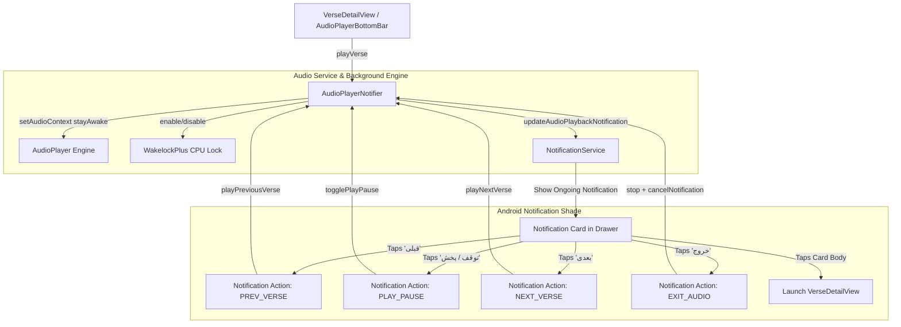

# Background Audio Recitation & Notification Shade Controller Implementation Plan

## 1. Goal Description
Ensure the Quran Mobile App continues reciting audio uninterrupted in the background when the app is minimized or the screen is locked, while displaying a persistent, interactive media controller notification in the Android notification drawer / shade (as shown in the user's reference image). Provide an explicit **Exit** button ("خروج") directly inside the notification window to immediately stop playback and dismiss the notification when no longer needed.

---

## 2. Core Requirements

1. **Uninterrupted Background Audio Playback**:
   - Audio must not pause or terminate when the user leaves the app, switches to other applications (e.g., Instagram, browser), or locks the screen.
   - Seamlessly advance to the next verse (or handle page loops / verse repeats) in the background.
   - Acquire CPU `WakelockPlus` and configure Android `AudioContext` with `stayAwake: true` and `audioFocus: AndroidAudioFocus.gain`.

2. **Persistent Notification in Android Notification Drawer**:
   - Display an ongoing notification card in the Android notification shade:
     - **Title**: Surah name and Verse number (e.g. `سوره غافر • آیه ۱` or `سوره غافر • بسم‌الله الرحمن الرحیم`).
     - **Body**: Reciter name and playback status (e.g. `قاری: مشاری العفاسی • در حال پخش`).
     - **Channel**: Low importance (silent, no sound or vibration on verse transition to prevent annoying beeps every few seconds).
     - **Visibility**: Public (visible on lock screen and notification shade).

3. **In-Notification Interactive Action Buttons**:
   - **Previous Verse** ("قبلی"): Jumps to previous verse.
   - **Play / Pause** ("توقف" / "پخش"): Toggles playback state in real-time.
   - **Next Verse** ("بعدی"): Advances to next verse.
   - **Exit Button** ("خروج"):
     - Immediately stops audio playback.
     - Releases CPU wake lock.
     - Cancels and dismisses the notification completely from the notification shade window.

4. **Tap-to-Resume Navigation**:
   - Tapping the body of the notification card brings the user back into the app directly to `VerseDetailView` for the active Surah and Verse.

---

## 3. Architecture & Data Flow



---

## 4. Proposed Changes

### Component 1: `NotificationService` (`src/core/notifications/notification_service.dart`)
- Define dedicated audio playback channel:
  - `channelAudioPlayback = 'quran_audio_playback_channel'`
  - Channel importance: `Importance.low` (silent, non-intrusive on auto-advance).
  - Sound: `false`, Vibration: `false`.
- Define notification ID: `idAudioPlayback = 3001`.
- Implement `updateAudioPlaybackNotification`:
  - Builds `AndroidNotificationDetails` with:
    - `ongoing: isPlaying` (persistent while reciting).
    - `category: AndroidNotificationCategory.transport`.
    - `visibility: NotificationVisibility.public`.
    - `showWhen: false`.
    - `color: Color(0xFF1B4332)` (Islamic Green theme).
    - Four action buttons: `PREV_VERSE`, `PLAY_PAUSE`, `NEXT_VERSE`, `EXIT_AUDIO`.
- Implement `cancelAudioPlaybackNotification`:
  - Cancels `idAudioPlayback` to dismiss the card.
- Add `registerAudioActionCallbacks` and `_handleNotificationResponse`:
  - Dispatches actions directly to `AudioPlayerNotifier`.
  - Defines top-level `@pragma('vm:entry-point') notificationTapBackground` handler for background actions.

---

### Component 2: `AudioPlayerNotifier` (`src/features/audio/presentation/audio_player_notifier.dart`)
- Add public navigation and control methods:
  - `playNextVerse()`
  - `playPreviousVerse()`
  - `togglePlayPause()`
- Register action callbacks with `NotificationService` upon initialization.
- Integrate notification updates into playback lifecycle:
  - `playVerse`: acquire wake lock, trigger `updateAudioPlaybackNotification(isPlaying: true)`.
  - `pause`: release wake lock, trigger `updateAudioPlaybackNotification(isPlaying: false)`.
  - `resume`: acquire wake lock, trigger `updateAudioPlaybackNotification(isPlaying: true)`.
  - `stop`: release wake lock, trigger `cancelAudioPlaybackNotification()`.
  - `_onAudioCompleted`: when advancing to next verse, automatically updates notification with new Ayah info.
- In `_initAudioContext()`: Ensure `AudioContextAndroid` with `stayAwake: true` is properly active on player.

---

### Component 3: `main.dart` & Android Permissions
- In `main.dart`:
  - Request notification permissions on startup via `NotificationService.instance.requestPermissions()` so Android 13+ devices show the notification card in the shade without requiring a prior visit to settings.
- In `AndroidManifest.xml`:
  - Verify that `WAKE_LOCK`, `FOREGROUND_SERVICE`, `FOREGROUND_SERVICE_MEDIA_PLAYBACK`, and `POST_NOTIFICATIONS` are present.

---

## 5. Verification Plan

### Automated Verification
```bash
# Run Flutter unit and analyzer tests
cd src/quran_mobile_app
flutter analyze
flutter test
```

### Manual Verification
1. Start playing any Surah (e.g., Surah Ghafir or Surah Al-Fatihah).
2. Pull down the Android notification shade:
   - Verify the Quran notification card appears with Surah name, Ayah number, reciter name, and action buttons.
3. Minimize the app or lock the screen:
   - Verify audio continues reciting without stopping or stuttering.
   - Verify that when Verse 1 finishes, Verse 2 begins playing automatically in the background.
   - Check the notification shade: verify the Ayah number updates in real time.
4. Tap the **Pause** button in the notification:
   - Verify audio pauses and the action button changes to **Play**.
5. Tap the **Next** / **Previous** buttons:
   - Verify verse skips accordingly.
6. Tap the **Exit** ("خروج") button in the notification:
   - Verify audio immediately stops.
   - Verify the notification card vanishes completely from the notification drawer.
