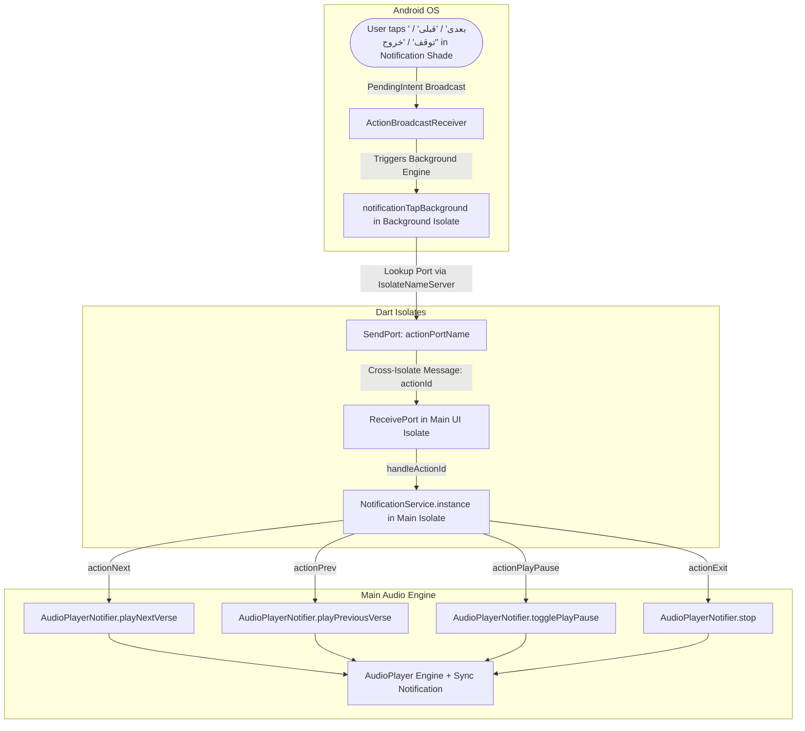

# Fix Notification Drawer Audio Controls & Missing Exit Button Implementation Plan

## 1. Problem Summary & Root Cause Analysis

### Problem 1: "the next before buttons will not be working"
1. **Missing BroadcastReceiver in `AndroidManifest.xml`**:
   The action buttons use `showsUserInterface: false` so that skipping or pausing does not force the app to pop open over other apps. `flutter_local_notifications` dispatches these background actions via `com.dexterous.flutterlocalnotifications.ActionBroadcastReceiver`. Because this receiver was not registered in `android/app/src/main/AndroidManifest.xml`, Android discarded the action broadcast intents on tap.
2. **Dart Isolate Memory Isolation**:
   When `ActionBroadcastReceiver` fires, Flutter invokes the top-level callback `notificationTapBackground` in a **new background isolate**. Dart isolates do not share memory. In this background isolate, `NotificationService.instance` has no callbacks registered (`_onPreviousVerseAction`, `_onNextVerseAction`, `_onPlayPauseAction`, etc. are all `null`). The actual `AudioPlayer` and `AudioPlayerNotifier` live in the **main UI isolate**. Without inter-isolate communication (`IsolateNameServer` + `ReceivePort`), the background tap events never reached the main isolate.

### Problem 2: "there ain't any exit button"
1. **Standard Notification 3-Action Limitation in Android**:
   In standard Android notifications (`NotificationCompat.Builder` without `MediaStyle`), Android enforces a strict limit: **a maximum of 3 action buttons**. The notification had 4 action buttons configured:
   - Index 0: `actionPrev` ("قبلی")
   - Index 1: `actionPlayPause` ("توقف" / "پخش")
   - Index 2: `actionNext` ("بعدی")
   - Index 3: `actionExit` ("خروج")
   Android silently discarded the 4th action button ("خروج")!
2. **Missing `MediaStyleInformation`**:
   Because `styleInformation: const MediaStyleInformation()` was not set, Android did not treat the notification as a MediaStyle notification. In Android, `NotificationCompat.MediaStyle` supports up to 5 action buttons.
3. **Channel Importance Level**:
   The notification channel was created with `Importance.low` and `Priority.low`. On Android, `low` importance pushes the notification into the minimized/silent drawer section where action buttons are collapsed or hidden. By migrating to a clean channel (`quran_audio_playback_channel_v2`) with `Importance.defaultImportance`, `playSound: false`, and `enableVibration: false`, the notification stays completely silent during verse transitions while rendering the full media control card.

---

## 2. Architecture & Data Flow



---

## 3. Proposed Changes

### Phase 1: Android Native Configuration
#### [MODIFY] [`android/app/src/main/AndroidManifest.xml`](file:///e:/projects/quran_mobile_app/src/quran_mobile_app/android/app/src/main/AndroidManifest.xml)
- Add the `ActionBroadcastReceiver` entry inside `<application>`:
  ```xml
  <receiver android:exported="false" android:name="com.dexterous.flutterlocalnotifications.ActionBroadcastReceiver" />
  ```

---

### Phase 2: Inter-Isolate Communication & MediaStyle Notification
#### [MODIFY] [`src/core/notifications/notification_service.dart`](file:///e:/projects/quran_mobile_app/src/quran_mobile_app/lib/src/core/notifications/notification_service.dart)
- Define port constant:
  ```dart
  static const String actionPortName = 'quran_audio_playback_action_port';
  static const String channelAudioPlaybackV2 = 'quran_audio_playback_channel_v2';
  ```
- In `initialize()`:
  - Clean up obsolete channel `quran_audio_playback_channel` if present on Android.
  - Register `channelAudioPlaybackV2` with `Importance.defaultImportance`, `playSound: false`, `enableVibration: false`.
  - Set up `ReceivePort` and register with `IsolateNameServer`:
    ```dart
    IsolateNameServer.removePortNameMapping(actionPortName);
    _actionReceivePort = ReceivePort();
    IsolateNameServer.registerPortWithName(_actionReceivePort!.sendPort, actionPortName);
    _actionReceivePort!.listen((dynamic data) {
      if (data is String) {
        handleActionId(data);
      }
    });
    ```
- In `notificationTapBackground`:
  - Look up `IsolateNameServer.lookupPortByName(NotificationService.actionPortName)`.
  - If found, forward `notificationResponse.actionId` directly to the main isolate.
- In `updateAudioPlaybackNotification`:
  - Set `styleInformation: const MediaStyleInformation()`.
  - Include all 4 action buttons (`actionPrev`, `actionPlayPause`, `actionNext`, `actionExit`).
  - Set `priority: Priority.defaultPriority`, `importance: Importance.defaultImportance`.

---

### Phase 3: AudioPlayerNotifier Integration & State Verification
#### [MODIFY] [`src/features/audio/presentation/audio_player_notifier.dart`](file:///e:/projects/quran_mobile_app/src/quran_mobile_app/lib/src/features/audio/presentation/audio_player_notifier.dart)
- Ensure verse advancement and previous verse edge cases (e.g. verse 1 repeat, surah boundary transition) are handled cleanly.
- Ensure `stop()` cancels the notification cleanly and releases player resources.

---

### Phase 4: Unit Testing & Verification
#### [MODIFY] [`test/notification_service_test.dart`](file:///e:/projects/quran_mobile_app/src/quran_mobile_app/test/notification_service_test.dart)
- Verify `handleActionId` triggers all 4 registered callbacks (`onNextVerse`, `onPreviousVerse`, `onPlayPause`, `onExit`).
- Verify channel identifiers and action ID constants.
- Run `flutter analyze` and `flutter test`.

---

## 4. Verification Plan

### Automated Tests
```bash
cd src/quran_mobile_app
flutter analyze
flutter test
```

### Manual Verification
1. Start recitation in the app.
2. Check Android notification drawer:
   - All 4 action buttons are visible: `قبلی`, `توقف` (or `پخش`), `بعدی`, `خروج`.
3. Tap `بعدی`: Audio immediately jumps to the next verse, notification title/verse number updates silently.
4. Tap `قبلی`: Audio immediately jumps to the previous verse.
5. Tap `توقف`: Audio pauses, button toggles to `پخش`.
6. Tap `خروج`: Audio terminates immediately, and the notification card vanishes from the shade.
