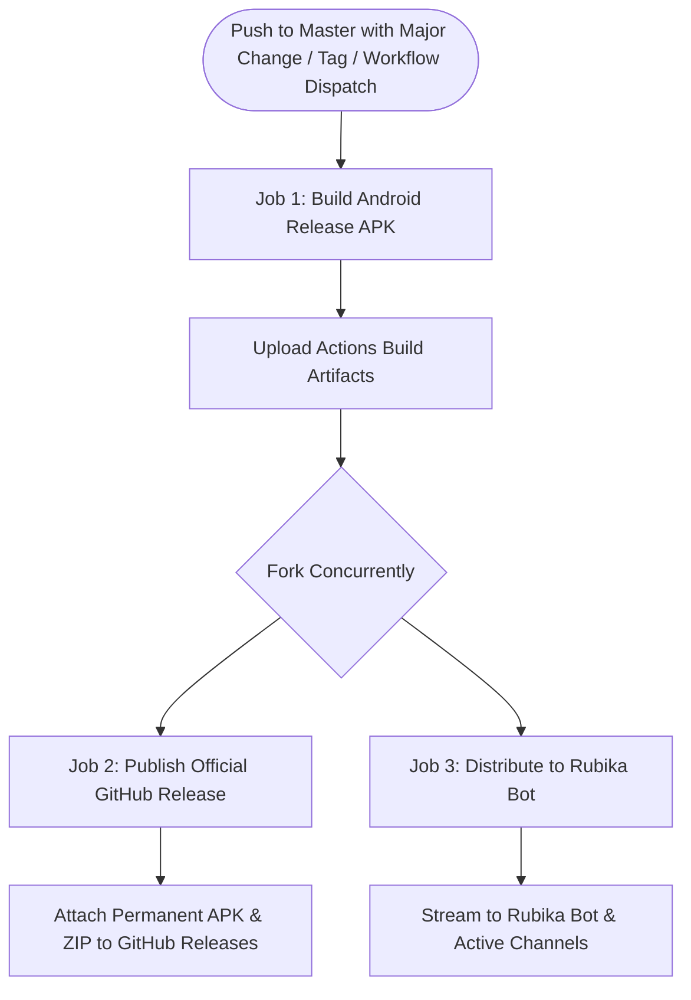

# Parallel Distribution & Automated GitHub Releases Implementation Plan

## 1. Overview & Objective
Enable fully automated, high-speed Continuous Delivery (CD) for the Quran Mobile App by:
1. **Parallelizing post-build distribution**: Creating GitHub Releases and delivering to messaging channels (Rubika Bot) concurrently rather than sequentially.
2. **Automating GitHub Releases on major changes**: Automatically generating version tags, compiling release notes, and attaching permanent release APK/ZIP packages to GitHub Releases whenever a major change or version tag lands on the repository.

---

## 2. Architecture & Concurrency Model



### 2.1 Major Change & Version Detection Strategy
A GitHub Release is triggered when:
- A git version tag is pushed (e.g., `v1.2.0`, `git push origin v1.2.0`).
- A commit message on `master` indicates a breaking or major feature:
  - Conventional Commits: `feat!:`, `fix!:`, `refactor!:`, `breaking:`, `major:`, `release:`
- In `workflow_dispatch`, the user explicitly sets `create_release: true` or passes `-Release -Version "vX.Y.Z"` via `scripts/build-apk.ps1`.

### 2.2 Permissions
GitHub Actions jobs creating releases require:
```yaml
permissions:
  contents: write
```

---

## 3. Implementation Steps

### Phase 1: Create Implementation Plan (`docs/parallel_build_and_automated_github_releases_plan.md`)
- Document architectural goals, inputs, job triggers, and fallback mechanisms.

### Phase 2: Refactor `.github/workflows/build-apk.yml`
- Add permissions `contents: write`.
- Add inputs: `create_release` (boolean), `release_tag` (string), `release_title` (string).
- Restructure into 3 discrete jobs:
  - `build-apk`: Compiles APK, outputs version and artifact names, uploads artifact.
  - `publish-release`: Runs when `create_release == true`, downloads artifact, publishes GitHub Release with `softprops/action-gh-release@v2`.
  - `send-to-rubika`: Runs in parallel with `publish-release` (`needs: build-apk`), downloads artifact, executes `scripts/upload-to-rubika.py`.

### Phase 3: Refactor `.github/workflows/build-mobile.yml`
- Add `tags: ['v*']` to `on.push`.
- Add commit message inspection step to determine if the commit represents a major change.
- Add parallel `publish-release` job that triggers on tags, major commits, or workflow inputs.

### Phase 4: Enhance `scripts/build-apk.ps1`
- Add `-Release`, `-Version`, and `-Title` parameters.
- Seamlessly pass release parameters to GitHub Actions when `-Cloud` is specified.

### Phase 5: Documentation & Validation
- Update `README.md` with Phase 21 details and workflow documentation.
- Validate YAML structure and verify script execution.

---

## 4. Execution & Status Tracking

| Phase | Description | Status |
|---|---|---|
| **Phase 1** | Create Implementation Plan (`docs/parallel_build_and_automated_github_releases_plan.md`) | ✅ Completed |
| **Phase 2** | Refactor `.github/workflows/build-apk.yml` with parallel `publish-release` & `send-to-rubika` | ✅ Completed |
| **Phase 3** | Refactor `.github/workflows/build-mobile.yml` with tag/major change detection & parallel release | ✅ Completed |
| **Phase 4** | Enhance `scripts/build-apk.ps1` with `-Release`, `-Version`, and `-Title` parameters | ✅ Completed |
| **Phase 5** | Documentation in `README.md` and script validation | ✅ Completed |
