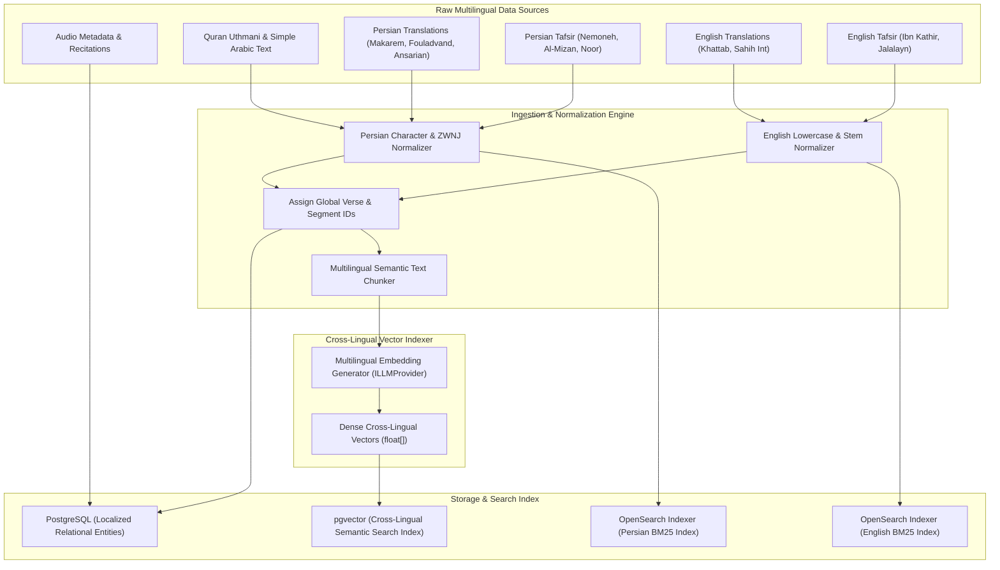
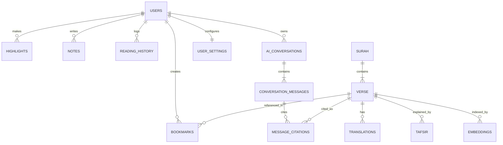
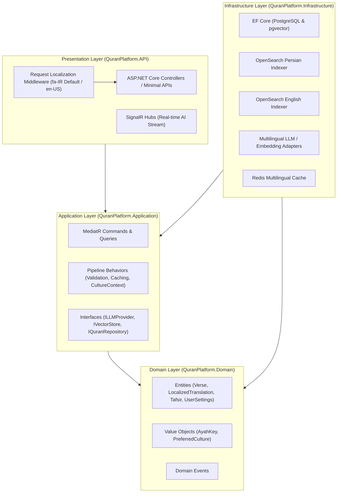
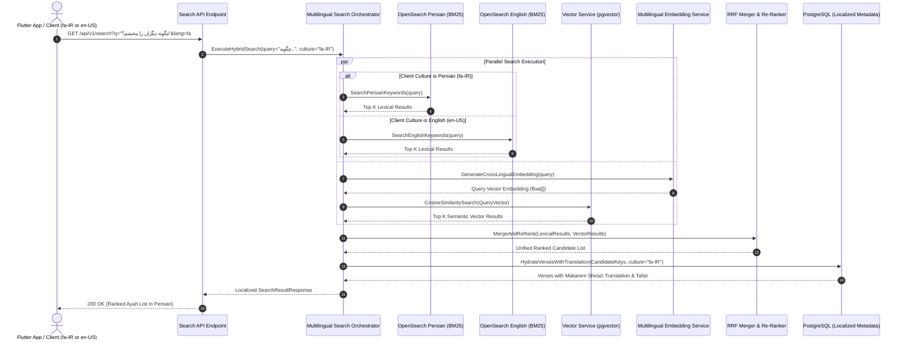
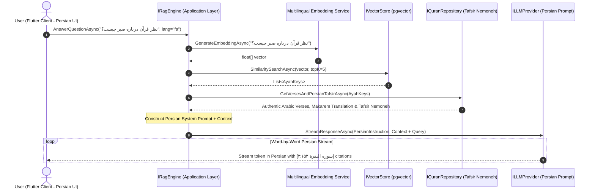
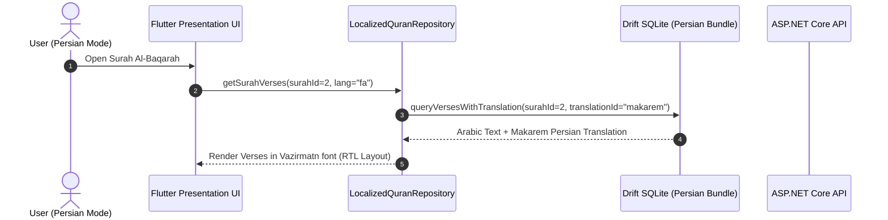

Created At: 2026-07-31T11:10:18Z
Completed At: 2026-07-31T11:10:18Z
File Path: `file:///e:/projects/quran_mobile_app/plan.md`

Based on your experience with **ASP.NET Core**, AI engineering, and your preference for building production-quality systems, I would treat this as a **multi-year platform**, not just a mobile app. The mobile application should simply be one client of a much larger AI-powered Quran knowledge platform.

---

# Vision

> **Build the world's most intelligent Quran exploration platform.**

Instead of competing with Quran.com or Tarteel on recitation or memorization alone, compete on **knowledge retrieval, semantic understanding, AI-assisted study, and research**.

### 🌐 Dual-Language Core (Persian Primary / English Secondary)

The platform is designed **bilingually from the ground up**, with **Persian (Farsi)** as the default primary language for UI, Quran translations, Tafsir commentaries, search, and AI assistant responses, and **English** as a fully supported secondary language:

* **Default Locale**: Persian (`fa` / `fa-IR`) with native **Right-To-Left (RTL)** layout orientation.
* **Secondary Locale**: English (`en` / `en-US`) with Left-To-Right (LTR) support.
* **Seamless Switching**: Dynamic language toggling without requiring application restarts.

The platform answers complex thematic and conceptual questions in both Persian and English:

* **Persian (Default)**: نظر قرآن درباره عدالت چیست؟ / آيات مشابه آیه ۲:۲۸۶ را نشان بده. / کدام پیامبران دچار تبعید شدند؟ / تفاسیر مختلف این آیه را مقایسه کن.
* **English**: What does the Quran say about justice? / Show verses similar to Ayah 2:286. / Which prophets experienced exile? / Compare how different tafsir explain this verse.

---

# Overall Architecture

```
                    Flutter Mobile App
             Android / iOS / Tablet / Web
            [Persian (Default RTL) / English LTR]

                           │

                     ASP.NET Core API
          Authentication & Request Localization Gateway
                  (fa-IR default / en-US)

        ┌─────────────────────────────────────┐
        │                                     │
        │          Internal Services          │
        │                                     │
        └─────────────────────────────────────┘

   User Service (Preferences & Localization)
   Search Service (Persian & English Hybrid NLP)
   Quran Service (Multilingual Text)
   Tafsir Service (Persian Nemoneh/Al-Mizan & English Ibn Kathir)
   Audio Service
   AI Service (Persian Grounded RAG Engine)
   Analytics Service
   Recommendation Service
   Notification Service (Localized Push)
   Sync Service

             │
             │

PostgreSQL (Relational & Localized Schemas)
Redis (Multilingual Cache)
ElasticSearch/OpenSearch (Persian & English Analyzers)
pgvector (Cross-lingual Semantic Embeddings)

             │

Object Storage (Audio Files, Fonts, Asset Packages)

             │

Multilingual Embedding Service (bge-m3 / text-embedding-3-small)

             │

Large Language Model (Persian Grounded System Prompts)
```

---

# Development Phases

The project is split into six major milestones.

---

# Phase 0 — Research & Data Curation (2–4 weeks)

This phase determines the quality of everything that follows. Special emphasis is placed on curating high-quality **Persian** datasets as default defaults alongside **English** datasets.

## Collect Quran Sources

### Persian Translations (Default Primary)

* **Ayatollah Makarem Shirazi** (Default Persian translation)
* **Mohammad Mahdi Fouladvand**
* **Hortasha / Hossein Ansarian**
* **Elahi Ghomshei**
* **Baha'oddin Khorramshahi**

### English Translations (Secondary)

* **Dr. Mustafa Khattab (The Clear Quran)** (Default English translation)
* **Sahih International**
* **Abdullah Yusuf Ali**
* **Marmaduke Pickthall**

### Additional Datasets

* Uthmani Quran text (KFGQPC Complex) & Simple Arabic text
* Word-by-word translations (Persian & English)
* Transliteration (Persian script transliteration & Latin IPA/English transliteration)

Each verse receives a permanent internal ID:

```
SurahID | VerseNumber | GlobalVerseID
```

---

## Collect Tafsir

### Persian Tafsir (Default Primary)

* **Tafsir Nemoneh** (Ayatollah Makarem Shirazi) — *Primary default Persian commentary*
* **Al-Mizan** (Persian translation of Allameh Tabataba'i's commentary)
* **Tafsir Noor** (Dr. Mohsen Qara'ati)

### English Tafsir (Secondary)

* **Tafsir Ibn Kathir** (English edition) — *Primary default English commentary*
* **Tafsir Al-Jalalayn** (English translation)
* **Ma'ariful Qur'an** (Mufti Shafi Usmani)

Each explanation links directly to its target verse ID and locale tag.

---

## Multilingual Text Normalization & NLP Engine

To handle search and AI accurately in both Persian and English:

* **Persian Text Normalization**:
  * Standardize character variants: `ی` vs `ي` (Arabic vs Persian Yeh), `ک` vs `ك` (Arabic vs Persian Kaf).
  * Handle ZWNJ (Zero-Width Non-Joiner / نیم‌فاصله) correctly during tokenization.
  * Diacritics stripping (Tashkeel / Erab) and Persian numeral normalization (`۰-۹` vs `0-9`).
* **Multilingual Embedding Selection**:
  * Select cross-lingual dense vector models (e.g., `text-embedding-3-small`, `bge-m3`, `cohere-multilingual-v3.0`) that align Persian, English, and Arabic concepts into a shared vector space.

---

## Collect Audio Metadata

Store metadata for reciters with support for Persian and English UI labels:

```
Reciter | Bitrate | Duration | File URL | ReciterName_FA | ReciterName_EN
```

---

## Metadata Tagging

Each verse includes rich structured metadata translated and queryable in both Persian and English:

```
Topics (موضوعات) | Keywords (کلیدواژه‌ها) | Prophets (پیامبران) | Stories (داستان‌ها) | Commands (اوامر) | Warnings (نواهی) | Makki/Madani | Revelation Order | Juz | Hizb | Page
```

---

## Data Ingestion & Multilingual Indexing Pipeline (UML Diagram)



---

## Phase 0 — Testing & Verification

To guarantee data integrity and normalization accuracy before database ingestion:

1. **Automated Data Quality & Schema Tests**:
   * Validate JSON schema and UTF-8 character encoding for all imported Arabic, Persian, and English text files.
   * Run checksums to verify zero missing Ayah or Surah entries across all 6,236 Quranic verses.
2. **Normalization & NLP Pipeline Unit Tests**:
   * Test Persian normalizer against edge cases (ZWNJ preservation, `ی`/`ک` variant mapping, diacritic stripping, Persian numerals).
   * Test English normalizer (lowercasing, stemmer behavior).
3. **Cross-Lingual Embedding Alignment Verification**:
   * Evaluate semantic similarity scores on benchmark parallel verse pairs across Persian, English, and Arabic to verify vector space alignment.
4. **Ingestion & Indexing Cross-Validation**:
   * Verify total entity counts match across PostgreSQL, OpenSearch (Persian/English indices), and pgvector.

---

# Phase 1 — Database Design

The database schema is designed to support localization, user language preferences, and bilingual content lookup natively.

---

## Entity-Relationship Diagram (UML ERD)



---

## User Settings & Localization Schema

```
UserSettings
  UserId (FK)
  PreferredLanguage (String, Default: 'fa') -- 'fa' for Persian, 'en' for English
  DefaultTranslationId (FK, Default: Makarem Shirazi for 'fa', Khattab for 'en')
  DefaultTafsirId (FK, Default: Tafsir Nemoneh for 'fa', Ibn Kathir for 'en')
  SecondaryLanguage (String, Default: 'en')
  TextDirection (String, Default: 'rtl')
  FontFamily (String, Default: 'Vazirmatn')
  QuranFontSize (Int)
  TranslationFontSize (Int)
```

---

## Core & Localized Tables

### User Tables

`Users`, `Bookmarks`, `Highlights`, `Notes`, `Collections`, `ReadingHistory`, `SearchHistory`, `UserSettings`, `Devices`, `Notifications`

### Quran Tables

```
Surah (Id, Number, NameArabic, NamePersian, NameEnglish, RevelationType, VerseCount)
Verse (Id, SurahId, VerseNumber, PageNumber, JuzNumber, TextUthmani, TextSimple)
Translation (Id, VerseId, LanguageCode, AuthorName, TranslationText) -- 'fa' or 'en'
Transliteration (Id, VerseId, LanguageCode, TransliterationText)
```

### Tafsir Tables

```
TafsirEdition (Id, Name, Author, LanguageCode, IsDefault) -- e.g. ('Tafsir Nemoneh', 'fa', True)
TafsirContent (Id, TafsirEditionId, VerseId, VolumeNumber, ContentText)
```

### Search & Taxonomy Tables

```
Topic (Id, NamePersian, NameEnglish, Category)
Keyword (Id, WordPersian, WordEnglish, RootArabic)
Embedding (Id, VerseId, LanguageCode, VectorData)
```

### AI Tables

```
Conversation (Id, UserId, Title, LanguageCode, CreatedAt)
ConversationMessage (Id, ConversationId, SenderRole, ContentText, LanguageCode)
```

---

## Phase 1 — Testing & Verification

To validate database schema robustness, migration stability, and query performance:

1. **EF Core Migration & Schema Dry-Run Tests**:
   * Execute automated migration dry-runs on clean PostgreSQL instances to verify constraint creation and index generation without errors.
2. **Referential Integrity & Unique Constraint Testing**:
   * Assert foreign key cascading behaviors and uniqueness rules (e.g., duplicate `(SurahId, VerseNumber)` prevention).
3. **Bilingual Seed Data & Configuration Validation**:
   * Verify default user preference seed records (`fa-IR` primary, `en-US` secondary) and translation/Tafsir mapping bindings.
4. **Query Performance & Execution Plan Benchmarks**:
   * Run `EXPLAIN ANALYZE` benchmarks on localized query patterns (e.g., retrieving Surah verses with Makarem Shirazi translation) targeting < 10ms execution times.

---

# Phase 2 — Backend Architecture (ASP.NET Core)

The backend follows **Clean Architecture** and **CQRS**, featuring built-in ASP.NET Core Request Localization to seamlessly serve Persian (`fa-IR`) by default and English (`en-US`).



---

## 1. Domain Layer (`QuranPlatform.Domain`)

* **Entities**: `Surah`, `Verse`, `Translation`, `Tafsir`, `User`, `UserSettings` (Persian default).
* **Value Objects**: `AyahKey`, `PreferredCulture` (`fa-IR` / `en-US`), `TextSnippet`.
* **Repository Contracts**: `IQuranRepository`, `ITafsirRepository`, `IUserRepository`, `ISearchIndexRepository`.

---

## 2. Application Layer (`QuranPlatform.Application`)

* **CQRS Queries & Commands**: Handle culture-aware queries (`GetSurahByIdQuery`, `SearchVersesQuery`, `GetTafsirForVerseQuery`).
* **Pipeline Behaviors**:
  * `CultureContextBehavior`: Automatically extracts `Accept-Language` header (defaulting to `fa-IR`) and injects current user culture into MediatR pipeline.
  * `ValidationBehavior` (FluentValidation localized in Persian & English).
  * `CachingBehavior` (Redis cache keyed by culture: `quran:verse:2:255:fa`).

---

## 3. Infrastructure Layer (`QuranPlatform.Infrastructure`)

* **ASP.NET Core Localization**: `RequestLocalizationOptions` configured with `DefaultRequestCulture = new RequestCulture("fa-IR")` and supported cultures `fa-IR` and `en-US`.
* **OpenSearch Multilingual Configuration**:
  * **Persian Analyzer**: Customized with Persian ZWNJ filter, Persian lowercase/char mapper (`ی`/`ک`), and Persian stemmer.
  * **English Analyzer**: Standard English stop-words and Porter stemmer.
* **LLM Adapters**: Configured to inject Persian system prompts by default when servicing `fa-IR` clients.

---

## 4. Presentation / API Layer (`QuranPlatform.API`)

* **Localization Middleware**: Automatically sets `CultureInfo.CurrentCulture` and `CultureInfo.CurrentUICulture` to `fa-IR` if unspecified by request headers.
* **Endpoints**: `/api/v1/quran`, `/api/v1/search`, `/api/v1/ai`, `/api/v1/user`.

---

## Phase 2 — Testing & Verification

To verify Clean Architecture boundary isolation, pipeline behavior correctness, and localization handling:

1. **Domain & CQRS Unit Testing**:
   * Unit tests for MediatR Query/Command handlers, FluentValidation rules, and domain entity methods using xUnit & FluentAssertions.
   * Verify pipeline behaviors (`CultureContextBehavior` injecting `fa-IR` default culture, `CachingBehavior` generating culture-keyed Redis keys).
2. **Integration Testing with WebApplicationFactory & Testcontainers**:
   * Spin up ephemeral PostgreSQL and Redis instances via Testcontainers to execute end-to-end integration tests for API endpoints.
3. **Request Localization & Culture Middleware Verification**:
   * Test HTTP requests with varying `Accept-Language` headers (`fa-IR`, `en-US`, missing header fallback to `fa-IR`) to confirm correct `CultureInfo` resolution.
4. **Architecture & Dependency Rule Testing**:
   * Execute NetArchTest suite to enforce that `QuranPlatform.Domain` has zero external dependencies and `QuranPlatform.Application` depends only on Domain.

---

# Phase 3 — Search Engine

The search architecture provides comprehensive **Multilingual Hybrid Search** optimized for both Persian and English queries.

---

## Multilingual Search Pipeline

### 1. Keyword & Stemmed Search

* **Persian**: Handles ZWNJ (نیم‌فاصله), prefix stripping (e.g. `می‌` , `بی‌` , `است`), Persian character variations (`ی`/`ک`), and Persian stemmers.
* **English**: Handles standard English stemming (e.g., `forgive` -> `forgiveness`, `forgiven`).

### 2. Phrase & Exact Search

* Supports exact phrase matching across Persian translations (e.g., `"بنی اسرائیل"` , `"روز قیامت"`) and English translations (`"Children of Israel"`, `"Day of Judgment"`).

### 3. Fuzzy Search

* Handles spelling mistakes and character variations in both Persian (e.g., `ابراهیم` vs `إبراهيم`) and English (e.g., `Moses` vs `Mosa`).

### 4. Semantic Search

* Queries in **Persian** (e.g., "چگونه دیگران را ببخشم؟") or **English** ("How should I forgive someone?") are embedded using a cross-lingual embedding model into the vector space, retrieving semantically matching verses regardless of exact word matches.

### 5. Multilingual Hybrid Search (RRF)

Combines BM25 lexical search (Persian/English OpenSearch) and Cosine Similarity vector search (`pgvector`) using Reciprocal Rank Fusion (RRF).

---

### Hybrid Search Execution Sequence (UML Diagram)



---

## Phase 3 — Testing & Verification

To ensure search accuracy, relevancy, and real-time execution speeds:

1. **Lexical Search Precision & Recall Benchmarks**:
   * Run automated evaluations on OpenSearch BM25 indices using a golden query dataset in Persian and English.
2. **Semantic Vector Search Quality Tests**:
   * Test cross-lingual queries (e.g., Persian query retrieving relevant verses indexed in English/Arabic vector space) measuring Precision@K and Mean Reciprocal Rank (MRR).
3. **RRF Algorithm & Tie-Breaking Unit Tests**:
   * Verify Reciprocal Rank Fusion merging logic to confirm deterministic rank calculation and score normalization.
4. **Search SLA & Stress Testing**:
   * Execute k6 / NBomber load tests under simulated concurrent user traffic to ensure search response times remain < 100ms at p95.

---

# Phase 4 — AI & RAG Engine Architecture

The RAG engine is isolated behind clean abstractions and produces **Grounded Persian Responses by Default** using authentic Persian Tafsir sources (Tafsir Nemoneh / Al-Mizan), with full capability to respond in English.

---

## Clean Architecture Abstractions

```csharp
public interface ILLMProvider {
    IAsyncEnumerable<string> StreamResponseAsync(string prompt, SystemInstruction instructions, CancellationToken ct);
}

public interface IEmbeddingService {
    Task<float[]> GenerateEmbeddingAsync(string text, CancellationToken ct);
}

public interface IRagEngine {
    Task<GroundedAnswer> AnswerQuestionAsync(string question, UserContext context, string preferredLanguage = "fa", CancellationToken ct = default);
}
```

---

## Persian-Default System Prompts & Guardrails

The RAG prompt builder injects localized system instructions:

* **Persian Instruction (Default)**:

  > "شما یک دستیار هوشمند مطالعه قرآن هستید. پاسخ‌های شما باید صرفاً بر اساس آیات مستخرج و تفاسیر معتبر ارائه شده (مانند تفسیر نمونه و المیزان) باشد. پاسخ‌ها باید به زبان فارسی روان، محترمانه و دقیق همراه با ارجاع دقیق به سوره و آیه (مانند [سوره البقرة ۲:۲۵۵]) و منبع تفسیر باشد. اگر اطلاعات کافی در متن موجود نیست، صریحاً اعلام کنید: 'در منابع موجود اطلاعات کافی برای پاسخ دقیق یافت نشد.'"
  >
* **English Instruction (Secondary)**:

  > "You are an intelligent Quran study assistant. Your answers must strictly rely on the provided retrieved verses and authentic tafsir extracts (such as Ibn Kathir). Provide accurate, respectful answers in English with explicit citations (e.g., [Surah Al-Baqarah 2:255]). If information is insufficient, respond: 'The available sources do not contain enough information to answer this question accurately.'"
  >

---

## RAG Pipeline Sequence (UML Diagram)



---

## Phase 4 — Testing & Verification

To guarantee AI response grounding, citation accuracy, and guardrail enforcement:

1. **RAG Grounding & Hallucination Evaluation Suite**:
   * Run automated eval sets measuring faithfulness and answer relevance against retrieved Tafsir Nemoneh and Al-Mizan excerpts.
2. **Citation Integrity & Verification Testing**:
   * Parse AI responses to ensure every statement citation `[سوره:آیه]` maps to valid database verse IDs and authentic text.
3. **Guardrail & Out-of-Bounds Regression Tests**:
   * Test prompt injection, non-Quranic queries, and unanswerable prompts to confirm fallback triggers (`در منابع موجود اطلاعات کافی...`).
4. **Real-Time SignalR Streaming Latency & Resilience Tests**:
   * Test token streaming performance across simulated slow network connections to ensure smooth chunk delivery without memory leaks.

---

# Phase 5 — Flutter Mobile App Architecture

The Flutter application uses **Feature-First Clean Architecture** with **Riverpod** state management, built with native **RTL (Right-To-Left) Persian layout as default** and dynamic English support.

```
lib/src/
├── core/                         # Core infrastructure & localization
│   ├── database/                 # Drift (SQLite) setup & migrations
│   ├── network/                  # Dio HTTP Client with Accept-Language header
│   ├── localization/             # AppLocalizations (Persian fa_IR default / English en_US)
│   ├── theme/                    # Persian & English Typography (Vazirmatn / Inter)
│   └── utils/                    # Number formatters (Persian digit converter)
│
└── features/                     # Feature Modules (Reader, Search, Bookmarks, AI Chat, Audio)
    ├── domain/                   # Enterprise entities & usecases
    ├── data/                     # Data mapping & repositories
    └── presentation/             # Widgets with Directionality(RTL/LTR) support
```

---

## Typography & Localization Tech Stack

* **Default Locale**: `Locale('fa', 'IR')` (Persian).
* **Secondary Locale**: `Locale('en', 'US')` (English).
* **Text Direction**: Native `TextDirection.rtl` for Persian; `TextDirection.ltr` for English.
* **Persian Typography**: **Vazirmatn** / **Shabnam** font family for UI, menus, and Persian translation text.
* **English Typography**: **Inter** / **Roboto** font family for English UI and translations.
* **Arabic Quran Typography**: **KFGQPC Uthmanic Script** / **Scheherazade New**.
* **Localization Package**: `flutter_localizations` combined with `easy_localization` or `slang` for instant in-app language switching without app reboot.
* **Persian Number Formatting**: Dynamic conversion of verse numbers and page counts to Persian digits (`۱۲۳`) when in Persian mode.

---

## Offline-First Local Database (Drift SQLite)

The local SQLite database bundles complete **Persian Quran translations** (Makarem Shirazi, Fouladvand) and **English translations** (Mustafa Khattab) out-of-the-box so the application is 100% functional offline in both languages.



---

## Phase 5 — Testing & Verification

To ensure offline reliability, UI performance, and seamless RTL/LTR localization:

1. **Flutter Unit & State Notifier Tests**:
   * Unit test Riverpod providers, use cases, repository implementations, and data mappers.
2. **Drift SQLite Offline Database & Migration Integration Tests**:
   * Test initial database bundling, seed verification for Makarem Shirazi & Khattab translations, and schema migration paths.
3. **RTL / LTR Visual Golden Tests**:
   * Run Flutter Golden Tests for all core UI screens comparing Persian RTL (`Vazirmatn`) and English LTR (`Inter`) renders.
4. **E2E & UI Performance Benchmarks**:
   * Execute Flutter Integration Tests targeting 60fps smooth scrolling in long Surah list views and verifying instant in-app locale switching.

---

# AI Features (Bilingual Execution)

All AI study features operate natively in Persian (Default) and English:

## 1. Smart Search (جستجوی هوشمند)

* **Persian Query**: "دیدگاه قرآن درباره صبر و شکیبایی چیست؟"
* **English Query**: "What is the Quranic view on patience?"

## 2. Related Verses (آیات مرتبط)

* Recommends verses with similar thematic meaning across Persian and English commentary indexes.

## 3. AI Study & Tafsir Comparison (مطالعه و مقایسه تفاسیر)

* Compares explanations across **Tafsir Nemoneh**, **Al-Mizan**, and **Tafsir Noor** in Persian, or **Ibn Kathir** and **Jalalayn** in English.

```
آیه
 ↓
تفسیر نمونه (Default)
 ↓
تفسیر المیزان
 ↓
تفسیر نور (قرائتی)
 ↓
جمع‌بندی هوشمند به فارسی
```

---

# Admin Portal

Built with Blazor or React, localized in Persian & English:

* Manage Persian and English translations and Tafsir datasets.
* Moderate AI content and prompts in Persian and English.
* Review search statistics for Persian vs English queries.

---

# Suggested Development Timeline

| Milestone | Duration | Key Deliverables |
| :---------------------------------------- | :---------: | :---------------------------------------------------------------------------------------------------------------------------------------------- |
| **Phase 0 — Data Preparation** | 3–4 weeks | Curated Persian (Makarem, Fouladvand, Nemoneh) & English datasets, NLP normalizers, dataset schema & normalization unit tests. |
| **Phase 1 & 2 — Backend & DB** | 6–8 weeks | ASP.NET Core API with`fa-IR` default localization, OpenSearch Persian/English analyzers, PostgreSQL schema, integration & NetArchTest suites. |
| **Phase 3 — Hybrid Search Engine** | 4–5 weeks | Persian & English lexical + cross-lingual vector search with RRF re-ranking, precision/recall benchmarks & k6 load testing. |
| **Phase 4 — Grounded RAG AI** | 4–5 weeks | Persian-default prompt builder, Tafsir Nemoneh grounding, SignalR Persian streaming, RAG hallucination eval suite. |
| **Phase 5 — Flutter Mobile App** | 8–10 weeks | RTL Persian UI (Vazirmatn), dynamic language switcher, offline Drift DB, widget & RTL/LTR visual golden tests. |
| **Beta Testing & Launch** | 4 weeks | Performance tuning, Persian typography QA, full E2E validation, store publishing. |

---

# Conclusion

By structuring the platform with **Persian (Farsi) as the default primary language** and **English as a first-class secondary language** from data ingestion to UI layout, the Quran Knowledge Platform provides an uncompromised experience for Persian-speaking researchers and learners while remaining accessible globally.
